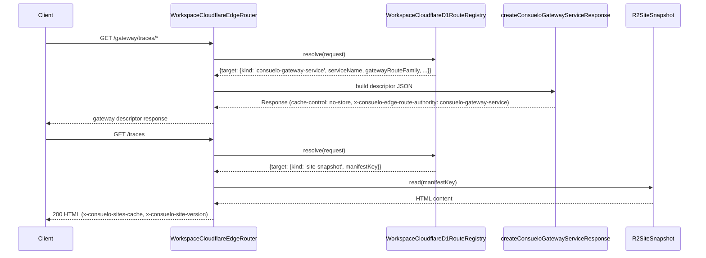

# pr #1050: Stream/sites

branch: `stream/sites` → `main`
state: OPEN
files changed: 14

## file attention map

- `packages/os/scripts/lib/install-edge-site-publisher.ts` — 1 comment(s) from coderabbitai
- `packages/os/scripts/lib/workspace-cloudflare-edge-router.ts` — 1 comment(s) from coderabbitai
- `packages/os/tests/workspace-edge-sites-gateway-integration.test.ts` — 1 comment(s) from coderabbitai
- 11 file(s) with no review comments

## review verdicts

- **coderabbitai**: commented — **Actionable comments posted: 3**

## inline comments

### `packages/os/scripts/lib/install-edge-site-publisher.ts`

**coderabbitai** (line 152):

> _⚠️ Potential issue_ | _🟡 Minor_ | _⚡ Quick win_
> 
> **Verification error context can point to the wrong URL.**
> 
> If `fetchImpl` throws on the second URL (e.g., `/traces`), the wrapped error on Line 152 still reports `plan.verifyUrl` (`/`). This obscures the actual failing endpoint during incident triage.
> 
> <details>
> <summary>Proposed fix</summary>
> 
> ```diff
> -  try {
> -    for (const verifyUrl of plan.verifiedUrls) {
> +  let failingVerifyUrl = plan.verifyUrl;
> +  try {
> +    for (const verifyUrl of plan.verifiedUrls) {
> +      failingVerifyUrl = verifyUrl;
>        response = await (input.fetchImpl ?? defaultFetch)(verifyUrl, { headers: { 'cache-control': 'no-cache', 'user-agent': 'Consuelo-OS-Install' } });
>        const body = await response.text();
> @@
> -    throw new InstallEdgePublishError({ stage: 'edge_verify', workspaceHost: plan.workspaceHost, snapshotKey: plan.snapshotKey, logPath: log, message: `install edge publish verification failed for ${plan.verifyUrl}`, diagnostics: { error: error instanceof Error ? error.message : String(error) }, cause: error });
> +    throw new InstallEdgePublishError({ stage: 'edge_verify', workspaceHost: plan.workspaceHost, snapshotKey: plan.snapshotKey, logPath: log, message: `install edge publish verification failed for ${failingVerifyUrl}`, diagnostics: { error: error instanceof Error ? error.message : String(error), failingVerifyUrl }, cause: error });
>    }
> ```
> </details>
> 
> <details>
> <summary>🤖 Prompt for AI Agents</summary>
> 
> ```
> Verify each finding against current code. Fix only still-valid issues, skip the
> rest with a brief reason, keep changes minimal, and validate.
> 
> In `@packages/os/scripts/lib/install-edge-site-publisher.ts` around lines 136 -
> 152, The error message in the catch block references the wrong variable for the
> URL that failed during verification. When an exception occurs in the loop
> iterating through plan.verifiedUrls, the InstallEdgePublishError is created with
> message: 'install edge publish verification failed for ${plan.verifyUrl}' which
> always reports plan.verifyUrl (the first URL) instead of the actual verifyUrl
> variable from the current loop iteration. Change plan.verifyUrl to verifyUrl in
> the error message construction on line 152 to correctly report which URL
> actually failed verification.
> ```
> 
> </details>
> 
> <!-- fingerprinting:phantom:poseidon:hawk -->
> 
> <!-- cr-comment:v1:9be4a5a7755df7d4b9356d50 -->
> 
> <!-- This is an auto-generated comment by CodeRabbit -->

### `packages/os/scripts/lib/workspace-cloudflare-edge-router.ts`

**coderabbitai** (line 571):

> _⚠️ Potential issue_ | _🔴 Critical_ | _⚡ Quick win_
> 
> **Enforce auth before returning gateway descriptors.**
> 
> At Line 559, the `consuelo-gateway-service` branch returns `200` immediately without enforcing `resolution.auth`. This bypasses the `auth: 'required'` contract seeded for `/gateway/traces` routes, so unauthenticated callers can read protected route descriptors. Gate this branch with the same auth policy enforcement used for non-public routes before calling `createConsueloGatewayServiceResponse`.
> 
> <details>
> <summary>🤖 Prompt for AI Agents</summary>
> 
> ```
> Verify each finding against current code. Fix only still-valid issues, skip the
> rest with a brief reason, keep changes minimal, and validate.
> 
> In `@packages/os/scripts/lib/workspace-cloudflare-edge-router.ts` around lines 559
> - 571, The consuelo-gateway-service branch does not enforce auth validation
> before returning the response from createConsueloGatewayServiceResponse, which
> bypasses the auth required contract for protected routes. Add auth policy
> enforcement to this branch by gating the createConsueloGatewayServiceResponse
> call with the same auth validation logic that is applied to non-public routes,
> ensuring that unauthenticated callers cannot access the gateway descriptors.
> ```
> 
> </details>
> 
> <!-- fingerprinting:phantom:poseidon:hawk -->
> 
> <!-- cr-comment:v1:d5d6ec481c658c2a52340b56 -->
> 
> <!-- This is an auto-generated comment by CodeRabbit -->

### `packages/os/tests/workspace-edge-sites-gateway-integration.test.ts`

**coderabbitai** (line 333):

> _⚠️ Potential issue_ | _🔴 Critical_ | _⚡ Quick win_
> 
> **Auth-required gateway routes are asserted as public success.**
> 
> `integratedRouteRecord()` marks `/gateway/traces` and `/gateway/traces/events` as `auth: 'required'`, but this test performs unauthenticated requests (Line 304, Line 306) and asserts `200` + `ok: true`. That bakes an auth bypass into the contract and will block the CR-001 fix.
> 
> Please split this into:
> 1) unauthenticated request assertions that are rejected, and  
> 2) authenticated/internal request assertions that return the descriptor.
> 
> As per coding guidelines, "Include both success and failure paths when the code owns failure handling."
> 
> <details>
> <summary>🤖 Prompt for AI Agents</summary>
> 
> ```
> Verify each finding against current code. Fix only still-valid issues, skip the
> rest with a brief reason, keep changes minimal, and validate.
> 
> In `@packages/os/tests/workspace-edge-sites-gateway-integration.test.ts` around
> lines 288 - 333, The test is asserting successful responses (200 + ok: true) for
> unauthenticated requests to routes that are marked as auth: 'required' by
> integratedRouteRecord(), which contradicts the auth requirement. Split the test
> into two parts: first, add assertions that unauthenticated requests to the
> /gateway/traces/* routes (via router.fetch calls without authentication headers)
> are rejected with appropriate error status; second, add authenticated request
> assertions where you provide proper auth credentials or mark requests as
> internal, and verify those return 200 + ok: true with the expected gateway
> service descriptors. This ensures both the failure path (unauthenticated
> rejection) and success path (authenticated access) are properly tested.
> ```
> 
> </details>
> 
> <!-- fingerprinting:phantom:poseidon:hawk -->
> 
> <!-- cr-comment:v1:625dcef6fceaf44f24699c38 -->
> 
> _Source: Coding guidelines_
> 
> <!-- This is an auto-generated comment by CodeRabbit -->

## bot summaries

### qodo code-review

### Qodo reviews are paused for this user.

Troubleshooting steps vary by plan [Learn more →](https://docs.qodo.ai/subscription-plans#what-you%E2%80%99ll-see-when-reviews-are-paused)


**On a Teams plan?**
Reviews resume once this user has a paid seat *and* their Git account is linked in Qodo.
[Link Git account →](https://docs.qodo.ai/subscription-plans#linking-a-git-account)

**Using GitHub Enterprise Server, GitLab Self-Managed, or Bitbucket Data Center?**
These require an Enterprise plan - Contact us
[Contact us →](https://docs.qodo.ai/qodo-support#support)


### coderabbitai

<!-- This is an auto-generated comment: summarize by coderabbit.ai -->
<!-- review_stack_entry_start -->

[](https://app.coderabbit.ai/change-stack/consuelohq/opensaas/pull/1050?utm_source=github_walkthrough&utm_medium=github&utm_campaign=change_stack)

<!-- review_stack_entry_end -->
<!-- walkthrough_start -->

<details>
<summary>📝 Walkthrough</summary>

## Walkthrough

Introduces a `consuelo-gateway-service` route target kind across the D1 route registry, edge router, and route seeding layer. Route seeding now generates site-snapshot routes for `/` and `/traces` plus explicit trace gateway routes, with conditional inclusion of the app upstream route. Publish verification iterates over multiple URLs. A new integration test suite covers the end-to-end flow.

## Changes

**Trace Sites Gateway Routing and Publishing**

| Layer / File(s) | Summary |
|---|---|
| **D1 registry and edge router type contracts** <br> `packages/os/scripts/lib/workspace-cloudflare-d1-route-registry.ts`, `packages/os/scripts/lib/workspace-cloudflare-edge-router.ts` | `WorkspaceRouteD1RouteTarget` adds a `consuelo-gateway-service` union variant; `WorkspaceRouteD1Route.auth` widens to four modes; `WorkspaceRouteD1Resolution` mirrors the widened auth. `WorkspaceCloudflareEdgeRouteTarget` gains the matching `consuelo-gateway-service` shape with `serviceName`, `gatewayRouteFamily`, and `publicSiteRouteFamily`. |
| **Edge router gateway-service response handler** <br> `packages/os/scripts/lib/workspace-cloudflare-edge-router.ts` | `createConsueloGatewayServiceResponse` builds a `cache-control: no-store` JSON response describing workspace/routing details. The `fetch` resolution path branches on `consuelo-gateway-service` to return this response immediately, bypassing upstream/connector proxy logic. |
| **Route seed: site-snapshot, trace gateway routes, and origin URL mapping** <br> `packages/os/scripts/lib/workspace-edge-route-seed.ts` | Adds manifest key and site snapshot constants. A new helper builds `site-snapshot` routes for `/` and `/traces` with `static-shell` cache policy. OS connector routes are narrowed to `/mcp` only; two explicit trace gateway routes are added for `/gateway/traces/events` and `/gateway/traces`. `getTargetOriginUrl` gains `site-snapshot` (R2) and `consuelo-gateway://` fallback branches. App upstream route inclusion becomes conditional on `appUpstreamUrl`. |
| **Gateway registry case-insensitive descriptor check** <br> `packages/os/scripts/lib/consuelo-sites-gateway-registry.ts` | `assertGatewayServiceRegistration` lowercases both the descriptor string and `IMPLEMENTATION_TARGET_LABELS` entries before comparison, making the detection case-insensitive. |
| **Edge publisher: multi-URL verification and `verifiedUrls` result** <br> `packages/os/scripts/lib/install-edge-site-publisher.ts` | `WorkspaceEdgePublishResult` adds `verifiedUrls: string[]`. `createWorkspaceEdgeSnapshotPlan` builds a multi-route registry with trace and gateway-trace routes and emits `verifiedUrls`. `publishWorkspaceEdgeSnapshot` loops over `plan.verifiedUrls`, validating status/cache-authority/version/body-hash for each, and returns `verifiedUrls` plus the final verified HTTP status. |
| **Route seed contract test updates** <br> `packages/os/tests/workspace-edge-route-seed-contract.test.ts` | Expected routes array asserts `sites`-surface `site-snapshot` and trace gateway routes. Normalization test asserts `/` targets `site-snapshot`. SQL test gains gateway/trace service assertions and a stricter negative regex excluding `os-connector` for `/traces`. |
| **End-to-end integration test suite** <br> `packages/os/tests/workspace-edge-sites-gateway-integration.test.ts` | New 443-line Vitest suite defines contract types and helpers, then tests: route seeding with gateway descriptors and forbidden-leak guards; `/traces` served from site-snapshot shell; `/gateway/traces/*` resolved to gateway descriptors; adapter descriptor alignment; edge publish/verify for `/` and `/traces`; reserved-host rejection before cache/D1 access. |

## Sequence Diagram(s)



## Estimated code review effort

🎯 4 (Complex) | ⏱️ ~60 minutes

## Possibly related PRs

- [consuelohq/opensaas#1015](https://github.com/consuelohq/opensaas/pull/1015): Adds the `/gateway/traces/*` live endpoint handler and read-layer backend that the new `consuelo-gateway-service` routing targets in this PR are designed to reach.
- [consuelohq/opensaas#1022](https://github.com/consuelohq/opensaas/pull/1022): Introduced the `consuelo-sites-gateway-registry.ts` module and its descriptor/label validation logic that this PR makes case-insensitive.
- [consuelohq/opensaas#981](https://github.com/consuelohq/opensaas/pull/981): Modified `workspace-edge-route-seed.ts` and its contract test expectations, providing the direct predecessor of the seeding logic this PR extends with trace gateway and site-snapshot routes.

## Poem

> 🐇 Hopping through the gateway traces,
> Lowercase labels fall in places,
> `/traces` shells now serve their HTML,
> Verified URLs loop without fail,
> The rabbit stamped each route with care —
> `no-store` headers fill the air! 🌐

</details>

<!-- walkthrough_end -->
<!-- pre_merge_checks_walkthrough_start -->

<details>
<summary>🚥 Pre-merge checks | ✅ 3 | ❌ 2</summary>

## human comments

**chatgpt-codex-connector[bot]**:

> You have reached your Codex usage limits for code reviews. You can see your limits in the [Codex usage dashboard](https://chatgpt.com/codex/cloud/settings/usage).

**cloudflare-workers-and-pages[bot]**:

> ## Deploying with &nbsp;<a href="https://workers.dev"></a> &nbsp;Cloudflare Workers
> The latest updates on your project. Learn more about [integrating Git with Workers](https://developers.cloudflare.com/workers/ci-cd/builds/git-integration/).
> 
> | Status | Name | Latest Commit | Updated (UTC) |
> | -|-|-|-|
> | ❌ Deployment failed <br>[View logs](https://dash.cloudflare.com/?to=/90b2b9dfeefcad97b9e2325b2b2e7a96/workers/services/view/opensaas/production/builds/c189b242-dc9a-4780-a240-db69f7b28b6f) | opensaas | 2d5f4dfa | Jun 16 2026, 08:43 AM |

**ko**:

> --body - **High / Auth — :**  routes are seeded/published as , but the router returns a 200 JSON descriptor before enforcing route auth. The new integration test calls  with no session, signature, or internal auth header and expects 200, so the auth-required Trace gateway data/control route is effectively public.\n\n☑️ issues found\n\n<details>\n<summary>Structured review</summary>\n\n/gateway/traces/*auth: 'required'auth: 'required'/gateway/traces/gateway/traces/eventscreateConsueloGatewayServiceResponseconsuelo-gateway-service/gateway/traces/recent/gateway/traces/eventsresolution.authauth: 'required'/gateway/traces/*CONSUELO_RUN_WORKSPACE_GATEWAY_CONTRACTS=1 bun --cwd packages/os test tests/workspace-edge-sites-gateway-integration.test.ts/gateway/traces/*auth: 'required'consuelo-gateway-serviceGET /gateway/traces/recent/gateway/traces/eventsauth: 'required'/gateway/traces/*packages/os/scripts/lib/workspace-cloudflare-edge-router.tsconsuelo-gateway-serviceresolution.authpackages/os/tests/workspace-edge-sites-gateway-integration.test.ts/gateway/traces/*packages/os/scripts/lib/workspace-cloudflare-edge-router.ts:559-570consuelo-gateway-serviceauth: 'required'/gateway/traces/*packages/os/scripts/lib/workspace-cloudflare-edge-router.ts/gateway/traces/*auth: 'required'\n</details>\n\n<details>\n<summary>Prompt for AI Agents</summary>\n\nVerify each finding against the current PR diff before editing. Fix only findings that are still valid. For stale or already-fixed findings, record a brief reason and skip them. Keep changes focused, preserve existing Consuelo patterns, and validate with the most relevant tests/checks.\n\nFindings to verify and fix:\n1. CR-001 — High / Auth\n   File: \n   Lines: 559-570\n   Risk:  may be reachable without auth even though the route registry marks it .\n   Fix intent: enforce route auth before returning the Consuelo Gateway descriptor, or explicitly make/document the route public if that is the intended contract.\n   Validate: unauthenticated gateway requests are rejected; authorized/internal requests still return the expected descriptor.\n\nAfter changes, run the focused workspace edge/gateway tests and workspace review command. Report fixed, skipped, and validation results.\n</details>

**ko**:

> --body Corrected review summary: High permission issue in packages/os/scripts/lib/workspace-cloudflare-edge-router.ts lines 559 to 570. The new gateway-service branch returns 200 for Trace gateway routes that are configured as protected. Please enforce the route permission before returning the descriptor and add negative coverage. issues found

## action items

1. `packages/os/scripts/lib/install-edge-site-publisher.ts:152` — _⚠️ Potential issue_ | _🟡 Minor_ | _⚡ Quick win_ (coderabbitai)
2. `packages/os/scripts/lib/workspace-cloudflare-edge-router.ts:571` — _⚠️ Potential issue_ | _🔴 Critical_ | _⚡ Quick win_ (coderabbitai)
3. `packages/os/tests/workspace-edge-sites-gateway-integration.test.ts:333` — _⚠️ Potential issue_ | _🔴 Critical_ | _⚡ Quick win_ (coderabbitai)

---

## fixing these — full task loop

```
bun run stream:context -- --area <area>
bun run stream:sync -- --area <area>
bun run task:start -- --area <area> --title "fix review comments"
bun run review -- --mine
bun run task:push -- --message "fix(scope): address review comments" --changed
bun run task:pr
bun run task:prs
bun run task:merge -- --pr <N> --wait
bun run task:finish
```
