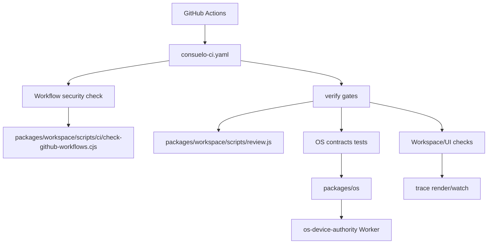

# pr #1314: task(workspace-agents): rename worker to subagent and quiet wait

branch: `task/workspace-agents/rename-worker-to-subagent-and-quiet-wait` → `stream/workspace-agents`
state: OPEN
files changed: 100

## file attention map

- `packages/workspace/scripts/ci/check-github-workflows.cjs` — 1 comment(s) from chatgpt-codex-connector[bot]
- `.github/workflows/consuelo-ci.yaml` — 1 comment(s) from chatgpt-codex-connector[bot]
- `packages/consuelo-docs/docs.json` — 1 comment(s) from chatgpt-codex-connector[bot]
- `packages/workspace/scripts/media-svg.py` — 1 comment(s) from chatgpt-codex-connector[bot]
- 99 file(s) with no review comments

## review verdicts

- **chatgpt-codex-connector[bot]**: commented — 

## inline comments

### `packages/workspace/scripts/ci/check-github-workflows.cjs`

**chatgpt-codex-connector[bot]** (line 26):

> **<sub><sub></sub></sub>  Inspect job-level workflow permissions**
> 
> When a changed workflow grants permissions under `jobs.<job>.permissions`, this scanner never sees it because `permissionLines` only enters on an unindented top-level `permissions:`. Existing repo workflows use job-level permissions (for example `.github/workflows/ci-docker-build.yaml` grants `packages: write` under a job), so a PR can add write permissions to any changed workflow and still pass this new security gate.
> 
> Useful? React with 👍 / 👎.

### `.github/workflows/consuelo-ci.yaml`

**chatgpt-codex-connector[bot]** (line 67):

> **<sub><sub></sub></sub>  Include deleted files in change detection**
> 
> When a PR only deletes a watched file, `--diff-filter=ACMR` filters out the `D` record, so the classifier writes an empty changed-file list and all downstream Consuelo gates can be skipped even though deletions can break imports or contracts. I confirmed this filter omits the deleted website component in this commit while plain `git diff --name-status` reports it as `D`; the same pattern also appears in `ci-website.yaml`.
> 
> Useful? React with 👍 / 👎.

### `packages/consuelo-docs/docs.json`

**chatgpt-codex-connector[bot]** (line 913):

> **<sub><sub></sub></sub>  Point localized Tools nav at existing pages**
> 
> This adds localized Tools navigation entries such as `l/fr/tools/overview`, but the corresponding files are not present (repo-wide check shows no `packages/consuelo-docs/l/fr/tools/overview.mdx`, only the English `packages/consuelo-docs/tools/overview.mdx`). Localized docs builds or users opening the French Tools tab will hit missing pages; the same missing `l/<locale>/tools/...` entries are repeated for the other locales added below.
> 
> Useful? React with 👍 / 👎.

### `packages/workspace/scripts/media-svg.py`

**chatgpt-codex-connector[bot]** (line 524):

> **<sub><sub></sub></sub>  Honor --dry-run before rendering SVG output**
> 
> When `media.svg` is called with `action=render`, `--dry-run`, and an `--output`, this workspace copy still calls `render_svg(..., out)`, which invokes the renderer and writes or overwrites the output file. The OS copy has a dry-run branch here, but the root `media:svg` script points at this workspace version, so facade dry runs can still mutate files.
> 
> Useful? React with 👍 / 👎.

## bot summaries

### coderabbitai

<!-- This is an auto-generated comment: summarize by coderabbit.ai -->
<!-- This is an auto-generated comment: skip review by coderabbit.ai -->

> [!IMPORTANT]
> ## Review skipped
> 
> Auto reviews are disabled on base/target branches other than the default branch.
> 
> 
> 
> Please check the settings in the CodeRabbit UI or the `.coderabbit.yaml` file in this repository. To trigger a single review, invoke the `@coderabbitai review` command.
> 
> <details>
> <summary>⚙️ Run configuration</summary>
> 
> **Configuration used**: Path: .coderabbit.yaml
> 
> **Review profile**: CHILL
> 
> **Plan**: Pro
> 
> **Run ID**: `cd54c906-eadf-48d8-aaa2-6c20444c888f`
> 
> </details>
> 
> You can disable this status message by setting the `reviews.review_status` to `false` in the CodeRabbit configuration file.
> 
> Use the checkbox below for a quick retry:
> - [ ] <!-- {"checkboxId": "e9bb8d72-00e8-4f67-9cb2-caf3b22574fe"} --> 🔍 Trigger review

<!-- end of auto-generated comment: skip review by coderabbit.ai -->

<!-- finishing_touch_checkbox_start -->

<details>
<summary>✨ Finishing Touches</summary>

<details>
<summary>🧪 Generate unit tests (beta)</summary>

- [ ] <!-- {"checkboxId": "f47ac10b-58cc-4372-a567-0e02b2c3d479", "radioGroupId": "utg-output-choice-group-unknown_comment_id"} -->   Create PR with unit tests
- [ ] <!-- {"checkboxId": "6ba7b810-9dad-11d1-80b4-00c04fd430c8", "radioGroupId": "utg-output-choice-group-unknown_comment_id"} -->   Commit unit tests in branch `task/workspace-agents/rename-worker-to-subagent-and-quiet-wait`

</details>

</details>

<!-- finishing_touch_checkbox_end -->
<!-- tips_start -->

---

Thanks for using [CodeRabbit](https://coderabbit.ai?utm_source=oss&utm_medium=github&utm_campaign=consuelohq/opensaas&utm_content=1314)! It's free for OSS, and your support helps us grow. If you like it, consider giving us a shout-out.

<details>
<summary>❤️ Share</summary>

- [X](https://twitter.com/intent/tweet?text=I%20just%20used%20%40coderabbitai%20for%20my%20code%20review%2C%20and%20it%27s%20fantastic%21%20It%27s%20free%20for%20OSS%20and%20offers%20a%20free%20trial%20for%20the%20proprietary%20code.%20Check%20it%20out%3A&url=https%3A//coderabbit.ai)
- [Mastodon](https://mastodon.social/share?text=I%20just%20used%20%40coderabbitai%20for%20my%20code%20review%2C%20and%20it%27s%20fantastic%21%20It%27s%20free%20for%20OSS%20and%20offers%20a%20free%20trial%20for%20the%20proprietary%20code.%20Check%20it%20out%3A%20https%3A%2F%2Fcoderabbit.ai)
- [Reddit](https://www.reddit.com/submit?title=Great%20tool%20for%20code%20review%20-%20CodeRabbit&text=I%20just%20used%20CodeRabbit%20for%20my%20code%20review%2C%20and%20it%27s%20fantastic%21%20It%27s%20free%20for%20OSS%20and%20offers%20a%20free%20trial%20for%20proprietary%20code.%20Check%20it%20out%3A%20https%3A//coderabbit.ai)
- [LinkedIn](https://www.linkedin.com/sharing/share-offsite/?url=https%3A%2F%2Fcoderabbit.ai&mini=true&title=Great%20tool%20for%20code%20review%20-%20CodeRabbit&summary=I%20just%20used%20CodeRabbit%20for%20my%20code%20review%2C%20and%20it%27s%20fantastic%21%20It%27s%20free%20for%20OSS%20and%20offers%20a%20free%20trial%20for%20proprietary%20code)

</details>


<sub>Comment `@coderabbitai help` to get the list of available commands.</sub>

<!-- tips_end -->

### qodo code-review


<h3>Qodo is busy working</h3>

Check back in a few minutes. Qodo's code review agents are on it.


### qodo code-review

## CI Feedback 🧐

A test triggered by this PR failed. Here is an AI-generated analysis of the failure:

<table><tr><td>

**Action:** danger-js</td></tr>
<tr><td>

**Failed stage:** [Utils / Run Danger.js](https://github.com/consuelohq/opensaas/actions/runs/28493395617/job/84454566584) [❌]

</td></tr>
<tr><td>

**Failed test name:** ""


</td></tr>
<tr><td>

**Failure summary:**

The action failed because the <code>twenty-utils:danger:ci</code> (Danger.js) step could not fetch required <br>GitHub PR metadata from the GitHub API.<br> - <code>danger ci --use-github-checks --failOnErrors</code> repeatedly <br>failed with <code>FetchError: Invalid response body ... Premature close</code> when requesting:<br>   - <br><code>.../pulls/1314/files?page=1&per_page=100</code> (PR files / diff)<br>   - <code>.../pulls/1314/commits</code> (PR commits)<br> - <br>The underlying error was <code>ERR_STREAM_PREMATURE_CLOSE</code> thrown by <code>node-fetch</code> while gunzipping the <br>response (<code>node_modules/node-fetch/lib/index.js:400:12</code>).<br> - The workflow includes a retry loop (3 <br>attempts), but all attempts hit the same transient API/stream failure, so the step exited with code <br><code>1</code>.<br>

</td></tr>
<tr><td>

<details><summary>Relevant error logs:</summary>


```yaml
1:  ##[group]Runner Image Provisioner
2:  Hosted Compute Agent
...

204:  ##[endgroup]
205:  Node 20 is being deprecated. This workflow is running with Node 24 by default. If you need to temporarily use Node 20, you can set the ACTIONS_ALLOW_USE_UNSECURE_NODE_VERSION=true environment variable. For more information see: https://github.blog/changelog/2025-09-19-deprecation-of-node-20-on-github-actions-runners/
206:  ##[group]Run actions/cache/restore@v4
207:  with:
208:  key: v4-node_modules-cache-node-24-742c9b8fc03d87c8926aa0cf554f9503b7bf8c0391c77acb805a244cea972c8a-4add6a4e40769ffe502b9f27e00781e5d2084c66
209:  restore-keys: v4-node_modules-cache-node-24-742c9b8fc03d87c8926aa0cf554f9503b7bf8c0391c77acb805a244cea972c8a-
210:  path: node_modules
211:  packages/*/node_modules
212:  enableCrossOsArchive: false
213:  fail-on-cache-miss: false
214:  lookup-only: false
215:  ##[endgroup]
216:  (node:2368) [DEP0040] DeprecationWarning: The `punycode` module is deprecated. Please use a userland alternative instead.
217:  (Use `node --trace-deprecation ...` to show where the warning was created)
218:  Cache hit for restore-key: v4-node_modules-cache-node-24-742c9b8fc03d87c8926aa0cf554f9503b7bf8c0391c77acb805a244cea972c8a-aa258aa7563a47b6ff3479afd8ac042eb5c32e29
219:  (node:2368) [DEP0169] DeprecationWarning: `url.parse()` behavior is not standardized and prone to errors that have security implications. Use the WHATWG URL API instead. CVEs are not issued for `url.parse()` vulnerabilities.
220:  Received 134217728 of 673692573 (19.9%), 125.7 MBs/sec
221:  Received 364904448 of 673692573 (54.2%), 172.5 MBs/sec
222:  Received 591396864 of 673692573 (87.8%), 186.4 MBs/sec
223:  Received 673692573 of 673692573 (100.0%), 181.1 MBs/sec
224:  Cache Size: ~642 MB (673692573 B)
225:  [command]/usr/bin/tar -xf /home/runner/work/_temp/0ff45870-b894-425c-bacb-3319a7477c01/cache.tzst -P -C /home/runner/work/opensaas/opensaas --use-compress-program unzstd
226:  Cache restored successfully
227:  Cache restored from key: v4-node_modules-cache-node-24-742c9b8fc03d87c8926aa0cf554f9503b7bf8c0391c77acb805a244cea972c8a-aa258aa7563a47b6ff3479afd8ac042eb5c32e29
228:  ##[group]Run set -o pipefail
229:  ^[[36;1mset -o pipefail^[[0m
230:  ^[[36;1m^[[0m
231:  ^[[36;1mmax_attempts=3^[[0m
232:  ^[[36;1mattempt=1^[[0m
233:  ^[[36;1mtransient_pattern='ERR_STREAM_PREMATURE_CLOSE|Invalid response body while trying to fetch https://api[.]github[.]com/.+: Premature close|Failed to fetch GitHub pull request files|Failed to fetch pull request diff'^[[0m
234:  ^[[36;1m^[[0m
235:  ^[[36;1mwhile [ "$attempt" -le "$max_attempts" ]; do^[[0m
236:  ^[[36;1m  log_file="$(mktemp)"^[[0m
237:  ^[[36;1m  echo "Running Danger.js attempt ${attempt}/${max_attempts}"^[[0m
238:  ^[[36;1m^[[0m
239:  ^[[36;1m  set +e^[[0m
240:  ^[[36;1m  (cd packages/twenty-utils && npx nx danger:ci) 2>&1 | tee "$log_file"^[[0m
241:  ^[[36;1m  status=${PIPESTATUS[0]}^[[0m
242:  ^[[36;1m  set -e^[[0m
243:  ^[[36;1m^[[0m
244:  ^[[36;1m  if [ "$status" -eq 0 ]; then^[[0m
245:  ^[[36;1m    exit 0^[[0m
246:  ^[[36;1m  fi^[[0m
247:  ^[[36;1m^[[0m
248:  ^[[36;1m  if grep -Eq "$transient_pattern" "$log_file" && [ "$attempt" -lt "$max_attempts" ]; then^[[0m

### qodo code-review

<h3>PR Summary by Qodo</h3>

Align Consuelo CI workflows and improve review/trace tooling

<code>✨ Enhancement</code> <code>⚙️ Configuration changes</code> <code>📝 Documentation</code> <code>🧪 Tests</code> <code>🐞 Bug fix</code> <code>🕐 40+ Minutes</code>


<details>
<summary>AI Description</summary>

<dl>
<dd>
<br/>

><pre>
>• Replace legacy GitHub Actions workflows with Consuelo CI gates and workflow security checks.
>• Improve local review tooling by separating related vs background pre-existing findings.
>• Enhance OS/workspace runtime support (ChatGPT/MCP OAuth, trace timestamp/layout refinements).
></pre>

</dd>
</dl>

</details>

<details>
<summary>Diagram</summary>

<dl>
<dd>

<br/>



</dd>
</dl>

</details>


<details>
<summary>High-Level Assessment</summary>

<dl>
<dd>

<br/>

>The following are alternative approaches to this PR:

<details>
<summary><b>1. Split by domain (CI vs OS auth vs docs/website)</b></summary>

<dl>
<dd>

- ➕ Much easier review/rollback surface
- ➕ Clearer ownership and release notes
- ➕ Reduces risk of unrelated conflicts
- ➖ More PR overhead
- ➖ May require sequencing if some changes depend on others

</dd>
</dl>

</details>

<details>
<summary><b>2. Adopt reusable workflow_call templates</b></summary>


## human comments

**cloudflare-workers-and-pages[bot]**:

> ## Deploying with &nbsp;<a href="https://workers.dev"></a> &nbsp;Cloudflare Workers
> The latest updates on your project. Learn more about [integrating Git with Workers](https://developers.cloudflare.com/workers/ci-cd/builds/git-integration/).
> 
> | Status | Name | Latest Commit | Updated (UTC) |
> | -|-|-|-|
> | ❌ Deployment failed <br>[View logs](https://dash.cloudflare.com/?to=/90b2b9dfeefcad97b9e2325b2b2e7a96/workers/services/view/opensaas/production/builds/45ce14b1-b55a-4bbe-aff0-92a3ed419927) | opensaas | 3dd9c700 | Jul 01 2026, 04:28 AM |

## action items

1. `packages/workspace/scripts/ci/check-github-workflows.cjs:26` — **<sub><sub></sub></sub>  Inspect job-level workflow permissions** (chatgpt-codex-connector[bot])
2. `.github/workflows/consuelo-ci.yaml:67` — **<sub><sub></sub></sub>  Include deleted files in change detection** (chatgpt-codex-connector[bot])
3. `packages/consuelo-docs/docs.json:913` — **<sub><sub></sub></sub>  Point localized Tools nav at existing pages** (chatgpt-codex-connector[bot])
4. `packages/workspace/scripts/media-svg.py:524` — **<sub><sub></sub></sub>  Honor --dry-run before rendering SVG output** (chatgpt-codex-connector[bot])

---

## fixing these — full task loop

```
bun run stream:context -- --area <area>
bun run stream:sync -- --area <area>
bun run task:start -- --area <area> --title "fix review comments"
bun run review -- --mine
bun run task:push -- --message "fix(scope): address review comments" --changed
bun run task:pr
bun run task:prs
bun run task:merge -- --pr <N> --wait
bun run task:finish
```
